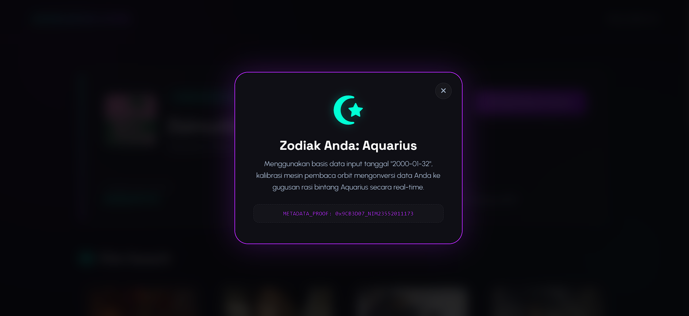
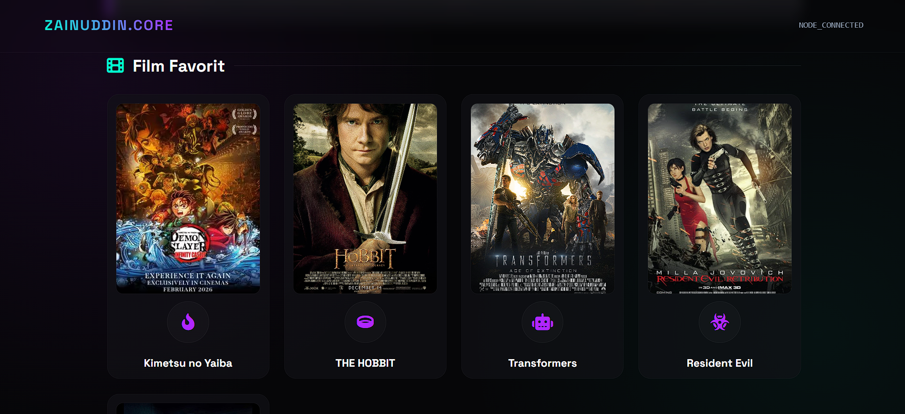
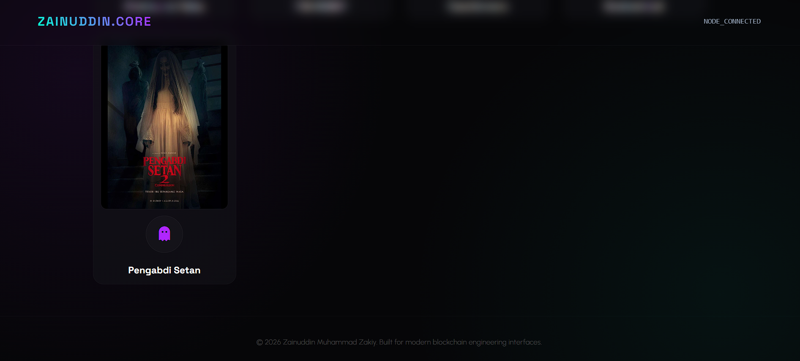

# 🎬 React Vite - Perkenalan Diri & Zodiac Checker

## 📖 Deskripsi Project

Project ini dibuat untuk memenuhi tugas Pemrograman Web 2 menggunakan React dan Vite.

Aplikasi menampilkan:

* Data perkenalan diri
* Nama
* Pekerjaan
* Tanggal lahir
* Pengecekan zodiac berdasarkan tanggal lahir
* Daftar 5 film favorit
* Tampilan modern dengan konsep Crypto Luxury UI

---

## 🛠️ Teknologi Yang Digunakan

* React JS
* Vite
* JavaScript
* CSS3
* HTML5

---

## ✨ Fitur

### 1. Perkenalan Diri

Menampilkan informasi pribadi berupa:

* Nama
* Pekerjaan
* Tanggal Lahir
* NIM

### 2. Zodiac Checker

User dapat menekan tombol:

```text
Cek Oracle Zodiak
```

Kemudian sistem akan menghitung zodiac berdasarkan tanggal lahir dan menampilkan hasilnya dalam bentuk modal popup.

### 3. Film Favorit

Menampilkan 5 film favorit lengkap dengan poster film.

Daftar film:

1. Kimetsu no Yaiba
2. The Hobbit
3. Transformers
4. Resident Evil
5. Pengabdi Setan

### 4. Modern User Interface

Menggunakan konsep:

* Glassmorphism
* Dark Mode
* Neon Accent
* Crypto Luxury Theme

---

## 📸 Screenshot

### Halaman Utama


---

### Popup Zodiac



---

### Daftar Film Favorit




---

## 🚀 Cara Menjalankan Project

Clone repository:

```bash
git clone https://github.com/bang-jekk/PEWEB2-React-Vite.git
```

Masuk ke folder project:

```bash
cd perkenalan
```

Install dependency:

```bash
npm install
```

Jalankan project:

```bash
npm run dev
```

---

## 👨‍💻 Identitas

Nama : Zainuddin Muhammad Zakiy

NIM : 23552011173

Program Studi : Teknik Informatika

---

## 📌 Repository

Link Github:

```text
https://github.com/bang-jekk/PEWEB2-React-Vite.git
```

---

© 2026 Zainuddin Muhammad Zakiy
